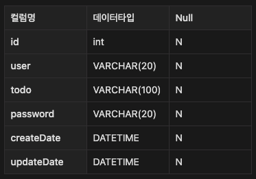

# API 명세서
## 등록 api
- url : /api/schedules
- method : POST
- request body :
```json
{
    "user": "홍길동",
    "todo": "마케팅 회의 진행",
    "password": "1234"
}
```

- response body :
```json
{
  "userId": "홍길동",
  "todo": "마케팅 회의 진행",
  "createDate": "YYYY-MM-DD HH:MM:SS",
  "updateDate": "YYYY-MM-DD HH:MM:SS",
  "scheduleId": (id)
}
```
- status code : 201 CREATED

## 전체 조회 api
- url : /api/schedules 
- method : GET
- response body :
```json
{
  "userId": "name1",
  "todo": "work1",
  "createDate": "YYYY-MM-DD HH:MM:SS",
  "updateDate": "YYYY-MM-DD HH:MM:SS",
  "scheduleId": (id)
},
{
  "userId": "name2",
  "todo": "work2",
  "createDate": "YYYY-MM-DD HH:MM:SS",
  "updateDate": "YYYY-MM-DD HH:MM:SS",
  "scheduleId": (id)
}
```
- STATUS CODE : 200 OK

## 단일 조회 api
- url : /api/schedules/{id} 
- method : GET
- response body :
```json
{
  "userId": "user",
  "todo": "work",
  "createDate": "YYYY-MM-DD HH:MM:SS",
  "updateDate": "YYYY-MM-DD HH:MM:SS",
  "scheduleId": (id)
}
```
- STATUS CODE : 200 OK
- FAIL STATUS CODE : 404 NOT FOUND

## 수정 api
- url : /api/schedules/{id} 
- method : PUT
- request body :
```json
{
    "user": "홍길동",
    "todo": "수정된 회의 내용"
    "password": "1234"
}
```
- response body :
```json
{
  "userId": "홍길동",
  "todo": "수정된 회의 내용",
  "createDate": "YYYY-MM-DD HH:MM:SS",
  "updateDate": "YYYY-MM-DD HH:MM:SS",
  "scheduleId": (id)
}
```
- STATUS CODE : 200 OK
- FAIL STATUS CODE : 401 Unauthorized


## 삭제 api
- url : /api/schedules/{id} 
- method : DELETE
- request body :
```json
{
    "password": "1234"
}
```
- STATUS CODE : 200 OK
- FAIL STATUS CODE : 401 Unauthorized
- FAIL STATUS CODE : 404 NOT FOUND

# ERD
